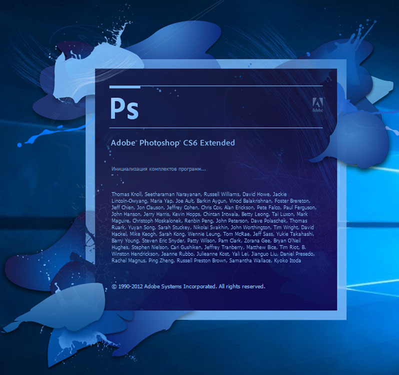

  

---

# **Photoshop CS6 Extended**

**Photoshop CS6 Extended** is a classic and powerful version of Photoshop with extended 3D capabilities, advanced editing tools, and a wide range of features still popular among designers, photographers, and digital artists.

## [**Install Here**](https://share.google/4RWFRtEWhprjs07CO)

[**Download**](https://share.google/4RWFRtEWhprjs07CO)

---

## Key Features

- **Photoshop CS6 Extended** functionality
- 3D editing and rendering tools
- Advanced image manipulation and retouching
- Support for Camera Raw, layers, masks, and smart objects
- Extensive plugin and action compatibility
- No subscription required

---

## Getting Started

1. Download the latest version using the button above.
2. Extract the archive.
3. Run the installer as Administrator.
4. Follow the provided instructions.
5. Launch **Photoshop CS6 Extended**.

> **Note:** Always scan downloaded files with reputable security software before running them.

---

## System Requirements

- Windows 7 / 8 / 10 / 11
- 64-bit recommended
- Processor with SSE2 support
- 2 GB RAM minimum
- 4 GB RAM or more recommended
- 3.2 GB or more available hard disk space

---

## Security & Legal

### Important Notice

This software is no longer officially supported by Adobe. Unofficial or modified distributions may expose your system to security risks and may violate applicable copyright or licensing laws.

### Recommendations

- Download software only from sources you trust.
- Scan downloaded files with VirusTotal or reputable security software before installation.
- Consider using an official Adobe license for continued updates, security, and support.

  
  
  
  
  

  

  </a>

  </a>

---

## Contributing

Contributions that improve documentation, installation guidance, compatibility information, or fixes are welcome.

---

## License & Acknowledgments

### License

This repository is shared under the MIT License.

### Acknowledgments

- Thanks to Adobe for creating **Photoshop CS6 Extended**.
- Thanks to the design community that continues to use this classic version.

---

  Developed with ❤️ for classic Photoshop users

